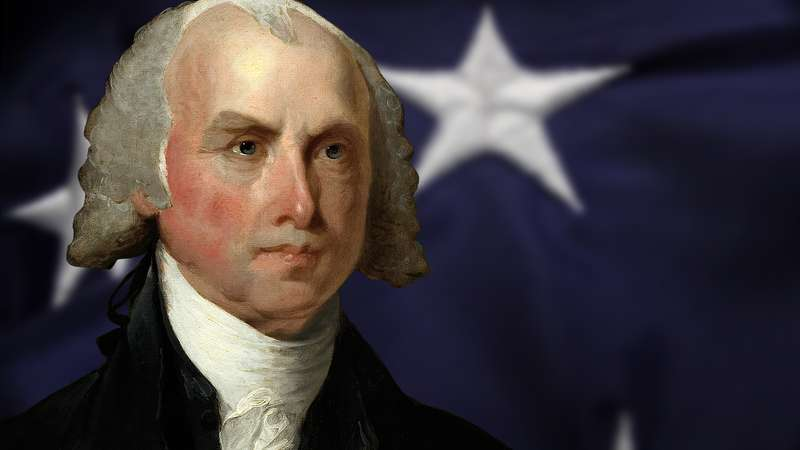

# Early Experiments in Central Banking
1791: THE FIRST ATTEMPT
The conflict between rural values and urban reality was sharply etched in the
first major political controversy following the ratification of the Constitution
in 1789, a controversy, in the first years of George Washington’s presidency,
which dealt with the myriad of issues regarding the monetary and fiscal powers
of the new federal government. Secretary of the Treasury Alexander Hamilton
advocated the creation of a central bank, a Bank of the United States, to manage the government’s money and to regulate the nation’s credit. Secretary of
State Thomas Jefferson strongly disagreed, arguing that since the Constitution 
did not specifically empower the Congress to create a central bank Congress
could not constitutionally do so. Hamilton responded that Congress could
create just such a bank under the constitutional clause giving it all powers
“necessary and proper” to the exercise of its specifically enumerated responsibilities; since Congress had been given so many monetary and fiscal powers,
Hamilton argued, it would be perfectly proper for it to create a central bank to
carry them out. Hamilton won the argument, and the First Bank of the United
States was created in 1791.
The First Bank of the United States had a capital stock of $10 million,
of which $2 million was subscribed by the federal government, while the remainder was subscribed by private individuals. Five of the 25 directors were
appointed by the United States government, while the other 20 were chosen
by the private investors in the bank. It was not only easily the largest bank of
its time, but it was also the largest corporation in the United States; it was a
nationwide bank, headquartered in Philadelphia but with branches in other
major cities, and it performed the basic banking functions of accepting deposits and issuing bank notes, of making loans and of purchasing securities.
Its power made it useful to American commerce and to the federal government but frightening to many of the American people. Its charter ran for
20 years, and when it expired, in 1811, Jefferson’s Virginia colleague, James
Madison, was President. 

An opponent of the initial bill in 1791, Madison, like
many other Jeffersonian Republicans, had changed his mind, and now subordinated his initial constitutional objections and favored the bank’s recharter
on the grounds of economic expediency. The vote in Congress was extremely
close, but the bill to recharter the bank failed in both houses by the margin of
a single vote.
Chaos quickly ensued, brought on by the disruptions of the War of
1812 and by the lack of a central regulating mechanism over banking and
credit. State-chartered private banks proliferated, and issued a bewildering
variety of bank notes that were sometimes of little value. Moreover, the
federal government lacked a safe repository for its own funds, a reliable mechanism to transfer them from place to place, and adequate means to market its
own securities.

